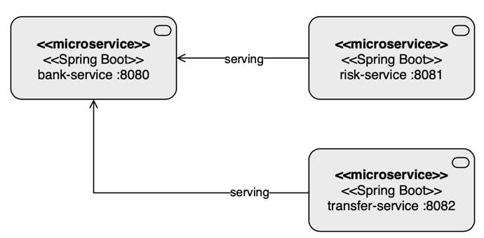

# Project title
Getting started using Virtual Threads
<hr>

## Motivation
Understand the use of Java 21 and Virtual Threads on Rest, Batching and standalone apps.
<hr>

## Build status
[](https://github.com/luizgustavocosta/virtual-threads/actions/workflows/maven.yml)
<hr>

## Quality Gate
Ignored
<hr>

## Features
- Money transfer 
- Payment processor
<hr>

## Run locally
- Download the project through the GitHub using
 ```shell
 git clone https://github.com/luizgustavocosta/virtual-threads.git
 cd virtual-threads 
 ```

### Command line
- Navigating through the projects

| # | Name             | Type                           | Depends on items | How to run                          |
|---|------------------|--------------------------------|------------------|-------------------------------------|
| 1 | bank-service     | Microservice                   | 5,7              | [Here](bank-service/README.md)      |
| 2 | batch-processing | Batch                          | -                | [Here](bathch-processing/README.md) |
| 3 | k6               | Test                           | 1                | [Here](k6/README.md)                |
| 4 | resources        | Static files for documentation | -                | N/A                                 |
| 5 | risk-service     | Microservice                   | -                | [Here](risk-service/README.md)      |
| 6 | standalone       | Program                        | -                | [Here](standalone/README.md)        |
| 7 | transfer-service | Microservice                   | -                | [Here](transfer-service/README.md)  |

### Docker compose
- Only for microservices
- Build the image described in each microservice README.md file and then
```shell
docker-compose -f docker-compose.yaml -p virtual-threads up
```
<hr>

## Languages and Tools:
<div>
  &nbsp;
  &nbsp;
  &nbsp;
  &nbsp;
  &nbsp;
  &nbsp;
  &nbsp;
  &nbsp;
</div>
</br>
<hr>

## Architecture:

### Money transfer


### Payment processor


## References
- [JEP-444](https://openjdk.org/jeps/444)
- [Spring Blog](https://spring.io/blog/2023/09/20/hello-java-21)
- [YouTube - Java 21 new feature: Virtual Threads](https://www.youtube.com/watch?v=5E0LU85EnTI)
- [YouTube - Devoxx Belgium - Venkat Subramaniam](https://www.youtube.com/watch?v=1zSF1259s6w)
- [AirHacks Podcast](https://airhacks.fm/#episode_280)
- [YouTube - Spring Batch](https://www.youtube.com/watch?v=vLw39E-pIiA)
- [Embracing Virtual Threads](https://spring.io/blog/2022/10/11/embracing-virtual-threads)
- [YouTube - Dan Vega](https://www.youtube.com/watch?v=THavIYnlwck)
- [YouTube - TheDevConf - Eder Moraes](https://www.youtube.com/watch?v=vXnuCKKRtSQ)