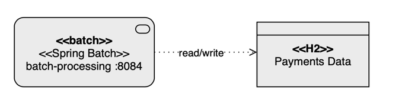

# Project title
Getting started using Virtual Threads
<hr>

## Motivation
Understand Virtual Threads using Java 21 with Rest, Batch, and Standalone apps.
<hr>

## Build status
[](https://github.com/luizgustavocosta/virtual-threads/actions/workflows/maven.yml)
<hr>

## Quality Gate
Ignored
<hr>

## What are Virtual Threads?
[_From Oracle_](https://docs.oracle.com/en/java/javase/21/core/virtual-threads.html#GUID-DC4306FC-D6C1-4BCC-AECE-48C32C1A8DAA) - Virtual threads are lightweight threads that reduce the effort of writing, maintaining, and debugging high-throughput concurrent applications.

For background information about virtual threads, see JEP 444.

A thread is the smallest unit of processing that can be scheduled. It runs concurrently with—and largely independently of—other such units. It's an instance of java.lang.Thread. There are two kinds of threads, platform threads and virtual threads.

<hr>

## Features
- Money Transfer 
- Payment Processor
<hr>

## Run locally
To run these projects locally you must have the Java 21 installed. My recommendation is to use [SDKMAN!](https://sdkman.io).

Example of my version, [Amazon Corretto 21.0.2](https://docs.aws.amazon.com/corretto/latest/corretto-21-ug/downloads-list.html), installed via SKDMAN!.
```shell
sdk list java | grep installed
Corretto      | >>> | 21.0.2       | amzn    | installed  | 21.0.2-amzn
````

- Download the project through GitHub using. If you don't have Git installed, please read [this tutorial first](https://git-scm.com/book/en/v2/Getting-Started-Installing-Git).
 ```shell
 git clone https://github.com/luizgustavocosta/virtual-threads.git
 cd virtual-threads 
 ```

### Command line
- Navigating through the projects

| # | Name             | Type                           | Depends on items | How to run                         |
|---|------------------|--------------------------------|------------------|------------------------------------|
| 1 | bank-service     | Microservice                   | 5,7              | [Here](bank-service/README.md)     |
| 2 | batch-processing | Batch                          | -                | [Here](batch-processing/README.md) |
| 3 | k6               | Test                           | 1                | [Here](k6/README.md)               |
| 4 | resources        | Static files for documentation | -                | N/A                                |
| 5 | risk-service     | Microservice                   | -                | [Here](risk-service/README.md)     |
| 6 | standalone       | Program                        | -                | [Here](standalone/README.md)       |
| 7 | transfer-service | Microservice                   | -                | [Here](transfer-service/README.md) |

### Docker compose
- Only for microservices
- Build the image described in each microservice README.md file and then
```shell
docker-compose -f docker-compose.yaml -p virtual-threads up
```
<hr>

## Languages and Tools:
<div>
  &nbsp;
  &nbsp;
  &nbsp;
  &nbsp;
  &nbsp;
  &nbsp;
  &nbsp;
  &nbsp;
</div>
</br>
<hr>

## Architecture:

### Money Transfer


### Payment Processor



## Virtual Threads usage scenarios
### Increase the processing request capacity - Microservices

50 users, i.e., 50 requests on [Thread-Per-Request Model](https://www.oreilly.com/library/view/head-first-servlets/9780596516680/ch04s04.html), and the server can handle 10.

With Virtual Threads, all requests will be handled on arrival, increasing the server responsiveness.

Below you can find the same test for 2 scenarios using 2 different tools, k6 and Apache Benchmarking (learned from Dan Vega's YouTube video)

- Open the file [application.yaml](bank-service/src/main/resources/application.yaml) and make the following changes 
  - Set the number of Tomcat threads be `10`. The default value is `200`
  - Set the property `spring.threads.virtual.enabled` to `true`
```yaml
server:
  tomcat:
    threads:
      max: '10'
spring:      
  threads:
    virtual:
      enabled: 'true' #'false' depending on test scenario
```
#### How to test
- k6

##### Platform Threads
Remember to set the property `spring.threads.virtual.enabled` to `false` and start the services bank, risk, and transfer.

````text
luizcosta@MacBook-Pro-de-Luiz k6 % k6 run --out json=test.json load_test.js

          /\      |‾‾| /‾‾/   /‾‾/   
     /\  /  \     |  |/  /   /  /    
    /  \/    \    |     (   /   ‾‾\  
   /          \   |  |\  \ |  (‾)  | 
  / __________ \  |__| \__\ \_____/ .io

  execution: local
     script: load_test.js
     output: json (test.json)

  scenarios: (100.00%) 1 scenario, 50 max VUs, 10m30s max duration (incl. graceful stop):
           * default: 400 iterations shared among 50 VUs (maxDuration: 10m0s, gracefulStop: 30s)


running (02m41.2s), 00/50 VUs, 400 complete and 0 interrupted iterations
default ✓ [======================================] 50 VUs  02m41.2s/10m0s  400/400 shared iters
INFO[0162] [k6-reporter v2.3.0] Generating HTML summary report  source=console
     ✓ status was 201

     checks.........................: 100.00% ✓ 400      ✗ 0   
     data_received..................: 65 kB   402 B/s
     data_sent......................: 87 kB   541 B/s
     errorRate......................: 0.00%   ✓ 0        ✗ 400 
     http_req_blocked...............: avg=385.35µs min=2µs   med=6µs    max=4.43ms p(90)=2.11ms p(95)=3.25ms  
     http_req_connecting............: avg=227.6µs  min=0s    med=0s     max=2.56ms p(90)=1.55ms p(95)=1.94ms  
     http_req_duration..............: avg=19.13s   min=4.01s med=20.12s max=28.5s  p(90)=24.15s p(95)=24.18s  
       { expected_response:true }...: avg=19.13s   min=4.01s med=20.12s max=28.5s  p(90)=24.15s p(95)=24.18s  
     http_req_failed................: 0.00%   ✓ 0        ✗ 400 
     http_req_receiving.............: avg=112.41µs min=27µs  med=75µs   max=2.71ms p(90)=168µs  p(95)=242.14µs
     http_req_sending...............: avg=49.65µs  min=15µs  med=34µs   max=559µs  p(90)=89.1µs p(95)=143.14µs
     http_req_tls_handshaking.......: avg=0s       min=0s    med=0s     max=0s     p(90)=0s     p(95)=0s      
     http_req_waiting...............: avg=19.13s   min=4.01s med=20.12s max=28.5s  p(90)=24.15s p(95)=24.18s  
     http_reqs......................: 400     2.481883/s
     iteration_duration.............: avg=19.14s   min=4.01s med=20.13s max=28.5s  p(90)=24.15s p(95)=24.18s  
     iterations.....................: 400     2.481883/s
     vus............................: 10      min=10     max=50
     vus_max........................: 50      min=50     max=50%                                                                                         luizcosta@MacBook-Pro-de-Luiz k6 % 

````

Remember to set the property `spring.threads.virtual.enabled` to `true` and restart the bank service.

##### Virtual Threads 
````text
luizcosta@MacBook-Pro-de-Luiz k6 % k6 run --out json=test.json load_test.js

          /\      |‾‾| /‾‾/   /‾‾/   
     /\  /  \     |  |/  /   /  /    
    /  \/    \    |     (   /   ‾‾\  
   /          \   |  |\  \ |  (‾)  | 
  / __________ \  |__| \__\ \_____/ .io

  execution: local
     script: load_test.js
     output: json (test.json)

  scenarios: (100.00%) 1 scenario, 50 max VUs, 10m30s max duration (incl. graceful stop):
           * default: 400 iterations shared among 50 VUs (maxDuration: 10m0s, gracefulStop: 30s)


running (00m33.1s), 00/50 VUs, 400 complete and 0 interrupted iterations
default ✓ [======================================] 50 VUs  00m33.0s/10m0s  400/400 shared iters
INFO[0033] [k6-reporter v2.3.0] Generating HTML summary report  source=console
     ✓ status was 201

     checks.........................: 100.00% ✓ 400       ✗ 0   
     data_received..................: 65 kB   2.0 kB/s
     data_sent......................: 87 kB   2.6 kB/s
     errorRate......................: 0.00%   ✓ 0         ✗ 400 
     http_req_blocked...............: avg=506.84µs min=1µs   med=4µs    max=5.24ms p(90)=3.42ms  p(95)=4.26ms  
     http_req_connecting............: avg=266.33µs min=0s    med=0s     max=2.69ms p(90)=1.94ms  p(95)=2.25ms  
     http_req_duration..............: avg=4.12s    min=4.01s med=4.04s  max=4.7s   p(90)=4.63s   p(95)=4.65s   
       { expected_response:true }...: avg=4.12s    min=4.01s med=4.04s  max=4.7s   p(90)=4.63s   p(95)=4.65s   
     http_req_failed................: 0.00%   ✓ 0         ✗ 400 
     http_req_receiving.............: avg=76.85µs  min=16µs  med=51.5µs max=879µs  p(90)=118.1µs p(95)=173.54µs
     http_req_sending...............: avg=44.65µs  min=7µs   med=24µs   max=402µs  p(90)=86.3µs  p(95)=186.49µs
     http_req_tls_handshaking.......: avg=0s       min=0s    med=0s     max=0s     p(90)=0s      p(95)=0s      
     http_req_waiting...............: avg=4.12s    min=4.01s med=4.04s  max=4.69s  p(90)=4.63s   p(95)=4.65s   
     http_reqs......................: 400     12.102768/s
     iteration_duration.............: avg=4.12s    min=4.01s med=4.04s  max=4.7s   p(90)=4.64s   p(95)=4.66s   
     iterations.....................: 400     12.102768/s
     vus............................: 31      min=31      max=50
     vus_max........................: 50      min=50      max=50%                                                                                        luizcosta@MacBook-Pro-de-Luiz k6 % 

````
Comparing the 2 logs, we can see clearly how the Virtual Threads address the concurrent situation 4,5x faster.
Keep in mind, that just applying one configuration

| # | Configuration    | Requests |Concurrent | Server Threads | Time taken for tests in seconds |
|---|------------------|----------|-----------|----------------|---------------------------------|
| 1 | Platform Threads | 400      | 50        |              10| 181.2                           |
| 2 | Virtual Threads  | 400      | 50        |              10| 33                              |


- Apache Benchmarking

Same recommendations of k6 steps

The command below is to call the endpoint `http://localhost:8080/v1/transfers` 400 times using 50 concurrent requests and wait 30 seconds for timeout
 
````shell
ab -n 400 -c 50 -s 30 -p 'resources/payload/transfer.json' -T 'application/json' http://localhost:8080/v1/transfers
````
#### Platform Threads

Remember to set the property `spring.threads.virtual.enabled` to `false` and start the services bank, risk and transfer.

```text
luizcosta@MacBook-Pro-de-Luiz virtual-threads % ab -n 400 -c 50 -s 30 -p 'resources/payload/transfer.json' -T 'application/json' http://localhost:8080/v1/transfers 
This is ApacheBench, Version 2.3 <$Revision: 1903618 $>
Copyright 1996 Adam Twiss, Zeus Technology Ltd, http://www.zeustech.net/
Licensed to The Apache Software Foundation, http://www.apache.org/

Benchmarking localhost (be patient)
Completed 100 requests
Completed 200 requests
Completed 300 requests
Completed 400 requests
Finished 400 requests


Server Software:        
Server Hostname:        localhost
Server Port:            8080

Document Path:          /v1/transfers
Document Length:        37 bytes

Concurrency Level:      50
Time taken for tests:   165.570 seconds
Complete requests:      400
Failed requests:        0
Total transferred:      68000 bytes
Total body sent:        86800
HTML transferred:       14800 bytes
Requests per second:    2.42 [#/sec] (mean)
Time per request:       20696.242 [ms] (mean)
Time per request:       413.925 [ms] (mean, across all concurrent requests)
Transfer rate:          0.40 [Kbytes/sec] received
                        0.51 kb/s sent
                        0.91 kb/s total

Connection Times (ms)
              min  mean[+/-sd] median   max
Connect:        0    1   0.9      1       5
Processing:  4046 19101 3414.3  20135   20225
Waiting:     4046 19100 3414.4  20134   20221
Total:       4048 19102 3414.0  20135   20225

Percentage of the requests served within a certain time (ms)
  50%  20135
  66%  20146
  75%  20155
  80%  20168
  90%  20198
  95%  20211
  98%  20219
  99%  20222
 100%  20225 (longest request)
 luizcosta@MacBook-Pro-de-Luiz virtual-threads 
```
#### Virtual Threads

Remember to set the property `spring.threads.virtual.enabled` to `true` and restart the bank service.

```text
luizcosta@MacBook-Pro-de-Luiz virtual-threads % ab -n 400 -c 50 -s 30 -p 'resources/payload/transfer.json' -T 'application/json' http://localhost:8080/v1/transfers
This is ApacheBench, Version 2.3 <$Revision: 1903618 $>
Copyright 1996 Adam Twiss, Zeus Technology Ltd, http://www.zeustech.net/
Licensed to The Apache Software Foundation, http://www.apache.org/

Benchmarking localhost (be patient)
Completed 100 requests
Completed 200 requests
Completed 300 requests
Completed 400 requests
Finished 400 requests


Server Software:        
Server Hostname:        localhost
Server Port:            8080

Document Path:          /v1/transfers
Document Length:        37 bytes

Concurrency Level:      50
Time taken for tests:   36.677 seconds
Complete requests:      400
Failed requests:        0
Total transferred:      68000 bytes
Total body sent:        86800
HTML transferred:       14800 bytes
Requests per second:    10.91 [#/sec] (mean)
Time per request:       4584.575 [ms] (mean)
Time per request:       91.692 [ms] (mean, across all concurrent requests)
Transfer rate:          1.81 [Kbytes/sec] received
                        2.31 kb/s sent
                        4.12 kb/s total

Connection Times (ms)
              min  mean[+/-sd] median   max
Connect:        0    1   1.3      1       8
Processing:  4011 4047  26.8   4038    4233
Waiting:     4010 4046  26.8   4037    4230
Total:       4011 4049  27.1   4040    4233

Percentage of the requests served within a certain time (ms)
  50%   4040
  66%   4058
  75%   4067
  80%   4069
  90%   4092
  95%   4101
  98%   4117
  99%   4120
 100%   4233 (longest request)
luizcosta@MacBook-Pro-de-Luiz virtual-threads 
```
Comparing the 2 logs, we can see clearly how the Virtual Threads address the concurrent situation 4,5x faster.
Keep in mind, that just applying one configuration

| # | Configuration    | Requests |Concurrent | Server Threads | Time taken for tests in seconds |
|---|------------------|----------|-----------|----------------|---------------------------------|
| 1 | Platform Threads | 400      | 50        |              10|                          165.570|
| 2 | Virtual Threads  | 400      | 50        |              10|                           36.677|


### Increase the processing capacity - Batching
Inside the **Step**, call the **taskExecutor** and send as a parameter the code below. Voilà, Virtual Threads in Action for Spring Batch
```java
.taskExecutor(new VirtualThreadTaskExecutor("VirtualThread-"))
```

## References
- [JEP-444](https://openjdk.org/jeps/444)
- [Spring Blog](https://spring.io/blog/2023/09/20/hello-java-21)
- [YouTube - Java 21 new feature: Virtual Threads](https://www.youtube.com/watch?v=5E0LU85EnTI)
- [YouTube - Devoxx Belgium - Venkat Subramaniam](https://www.youtube.com/watch?v=1zSF1259s6w)
- [AirHacks Podcast](https://airhacks.fm/#episode_280)
- [YouTube - Spring Batch](https://www.youtube.com/watch?v=vLw39E-pIiA)
- [Embracing Virtual Threads](https://spring.io/blog/2022/10/11/embracing-virtual-threads)
- [YouTube - Dan Vega](https://www.youtube.com/watch?v=THavIYnlwck)
- [YouTube - TheDevConf - Eder Moraes](https://www.youtube.com/watch?v=vXnuCKKRtSQ)
- [Apache Benchmarking](https://httpd.apache.org/docs/2.4/programs/ab.html)
