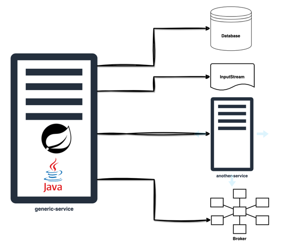
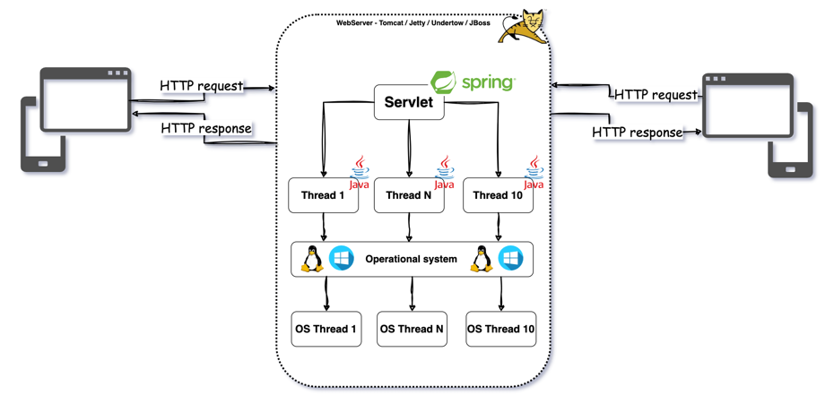
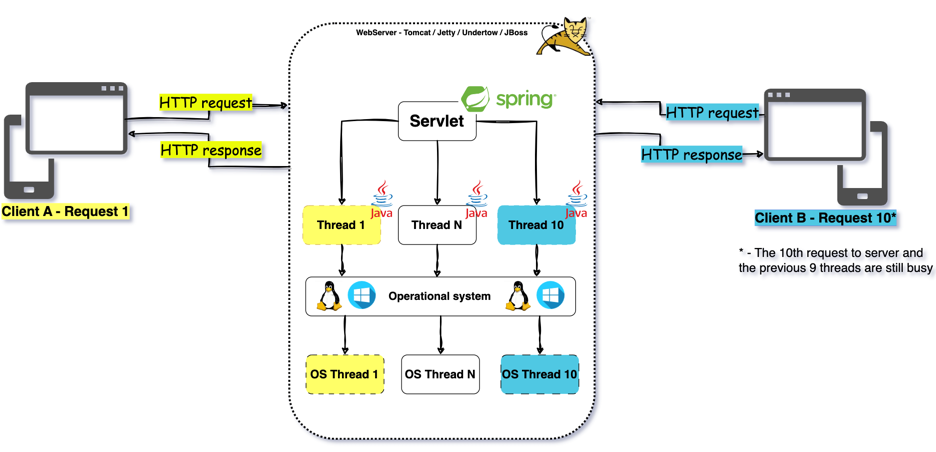
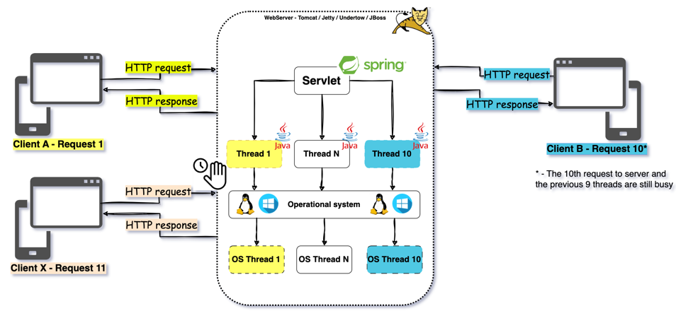
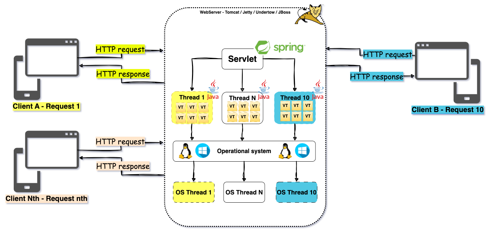

# Título do Projeto
Começando com Virtual Threadas
<hr>

## Versão em Inglês
[Clique aqui](README.md)

<hr>

## Motivação
Entender como usar Virtual Threads com Spring Boot, Batch e aplicações standalone
<hr>

## Build status
[](https://github.com/luizgustavocosta/virtual-threads/actions/workflows/maven.yml)
<hr>

## Quality Gate
Ignorado
<hr>

## O que são Virtual Threads?
[_From Oracle_](https://docs.oracle.com/en/java/javase/21/core/virtual-threads.html#GUID-DC4306FC-D6C1-4BCC-AECE-48C32C1A8DAA) Virtual Threads são threads leves que reduzem o esforço de gravação, manutenção e depuração de aplicativos simultâneos de alto rendimento.

Para obter informações básicas sobre threads virtuais, consulte JEP 444.

Uma Thread é a menor unidade de processamento que pode ser agendada. Funciona simultaneamente com e em grande parte independente de outras unidades semelhantes. É uma instância de java.lang.Thread.

<hr>

## Onde posso usar Threads Virtuais?

É recomendado quando seu sistema não está utilizando a CPU, ou seja, para **_I/O bound_**.

**_O que significa I/O bound?_**

[From Wikipedia](https://en.wikipedia.org/wiki/I/O_bound), refere-se a uma condição na qual o tempo necessário para concluir um cálculo é determinado principalmente pelo período gasto aguardando a conclusão das operações de entrada/saída, que pode ser justaposto ao limite da CPU. Esta circunstância surge quando a velocidade a que os dados são solicitados é mais lenta do que a velocidade com que são consumidos ou, por outras palavras, é gasto mais tempo a solicitar dados do que a processá-los.

Exemplo de cenários baseado nos vídeos do Dan Vega




<hr>

## Features
- Transferência de dinheiro
- Processador de pagamento 
<hr>

## Executando localmente
Para executar esses projetos localmente você deve ter o Java 21 instalado. Minha recomendação é usar [SDKMAN!](https://sdkman.io).

Exemplo da minha versão, [Amazon Corretto 21.0.2](https://docs.aws.amazon.com/corretto/latest/corretto-21-ug/downloads-list.html), instalado via SKDMAN!.
```shell
sdk list java | grep installed
Corretto      | >>> | 21.0.2       | amzn    | installed  | 21.0.2-amzn
````

- Baixe o projeto através do GitHub usando Git. Se você não tem o Git instalado, leia [this tutorial first](https://git-scm.com/book/en/v2/Getting-Started-Installing-Git).
 ```shell
 git clone https://github.com/luizgustavocosta/virtual-threads.git
 cd virtual-threads 
 ```

### Linha de comando
- Navegando pelos projetos

| # | Nome             | Tipo                       | Depende do item | Como executar?                           |
|---|------------------|----------------------------|-----------------|------------------------------------------|
| 1 | bank-service     | Microsserviço              | 5,7             | [Aqui](bank-service/README_pt_BR.md)     |
| 2 | batch-processing | Batch                      | -               | [Aqui](batch-processing/README_pt_BR.md) |
| 3 | k6               | Teste                      | 1               | [Aqui](k6/README_pt_BR.md)               |
| 4 | resources        | Arquivos para documentação | -               | N/A                                      |
| 5 | risk-service     | Microsserviço              | -               | [Aqui](risk-service/README_pt_BR.md)     |
| 6 | standalone       | Programa                   | -               | [Aqui](standalone/README_pt_BR.md)       |
| 7 | transfer-service | Microsserviço              | -               | [Aqui](transfer-service/README_pt_BR.md) |

### Docker compose
- Somente para os microsserviços
- Build the image described in each microservice README.md file and then
```shell
docker-compose -f docker-compose.yaml -p virtual-threads up
```
<hr>

## Linguagens e ferramentas:
<div>
  &nbsp;
  &nbsp;
  &nbsp;
  &nbsp;
  &nbsp;
  &nbsp;
  &nbsp;
  &nbsp;
</div>
</br>

| # | Nome          | Versão                      |
|---|---------------|-----------------------------|
| 1 | Java          | Amazon Corretto 21.0.2.13.1 |
| 2 | IntelliJ      | 2023.2.5 (Ultimate Edition) |
| 3 | k6            | 0.39.0                      |
| 4 | Spring Boot   | 3.2.2                       |
| 5 | Maven         | 3.6.3                       |
| 6 | Archimate     | 3.2                         |
| 7 | Docker Engine | 20.10.21                    |
| 8 | Git           | 2.24.3                      |
| 9 | ApacheBench   | 2.3                         |

<hr>

## Arquitetura:

### Transferência de dinheiro


### Processador de pagamento


## Cenários para uso de Virtual Threads
### Aumento da capacidade de processamento de requisições - Microsserviço

50 usuários, i.e., 50 requisições usando o [Thread-Per-Request Model](https://www.oreilly.com/library/view/head-first-servlets/9780596516680/ch04s04.html), e o servidor pode tratar 10 simutaneamente. Se você precisar de uma visão geral sobre o Thread-Per-Request-Model, verifique os diagramas abaixo.

#### Thread-Per-Request Model

Para cada solicitação do cliente, ou seja, o mesmo cliente envia a enésima solicitação, um thread será alocado pelo Tomcat Web Server para tratar a solicitação/resposta.

No modelo de thread tradicional, um thread do aplicativo está vinculado ao thread do sistema operacional.


Quando **Client A** chamar o aplicativo, a Thread 1 será vinculada a esta solicitação/resposta. O mesmo acontece com o **Client B**, a sua solicitação será tratada pela Thread 10, usando como exemplo a nossa aplicação com 10 Threads.



Este modelo funciona bem, até que o servidor fique sem threads disponíveis. Quando todos as threads do servidor estão ocupados, o **Client X** precisa aguardar a próximo thread seja liberada. Ninguém gosta disso.



Com Virtual Threads, todas as solicitações serão tratadas na chegada, aumentando a capacidade de resposta do servidor.



Abaixo você pode encontrar o mesmo teste para 2 cenários usando 2 ferramentas diferentes, k6 e Apache Benchmarking (aprendido no vídeo do Dan Vega no YouTube)

- Abra o arquivo [application.yaml](bank-service/src/main/resources/application.yaml) e faça as seguintes alterações:
    - Defina o número de threads do Tomcat como `10`. O valor padrão é `200`
    - Defina a propriedade `spring.threads.virtual.enabled` para `true`
```yaml
server:
  tomcat:
    threads:
      max: '10'
spring:      
  threads:
    virtual:
      enabled: 'true' #'false' dependendo do cenário de teste
```
#### Teste de performance 
- k6

##### Platform Threads
Lembre-se de definir a propriedade `spring.threads.virtual.enabled` como `false` e iniciar os serviços bank, risk e transfer.

````text
luizcosta@MacBook-Pro-de-Luiz k6 % k6 run --out json=test.json load_test.js

          /\      |‾‾| /‾‾/   /‾‾/   
     /\  /  \     |  |/  /   /  /    
    /  \/    \    |     (   /   ‾‾\  
   /          \   |  |\  \ |  (‾)  | 
  / __________ \  |__| \__\ \_____/ .io

  execution: local
     script: load_test.js
     output: json (test.json)

  scenarios: (100.00%) 1 scenario, 50 max VUs, 10m30s max duration (incl. graceful stop):
           * default: 400 iterations shared among 50 VUs (maxDuration: 10m0s, gracefulStop: 30s)


running (02m41.2s), 00/50 VUs, 400 complete and 0 interrupted iterations
default ✓ [======================================] 50 VUs  02m41.2s/10m0s  400/400 shared iters
INFO[0162] [k6-reporter v2.3.0] Generating HTML summary report  source=console
     ✓ status was 201

     checks.........................: 100.00% ✓ 400      ✗ 0   
     data_received..................: 65 kB   402 B/s
     data_sent......................: 87 kB   541 B/s
     errorRate......................: 0.00%   ✓ 0        ✗ 400 
     http_req_blocked...............: avg=385.35µs min=2µs   med=6µs    max=4.43ms p(90)=2.11ms p(95)=3.25ms  
     http_req_connecting............: avg=227.6µs  min=0s    med=0s     max=2.56ms p(90)=1.55ms p(95)=1.94ms  
     http_req_duration..............: avg=19.13s   min=4.01s med=20.12s max=28.5s  p(90)=24.15s p(95)=24.18s  
       { expected_response:true }...: avg=19.13s   min=4.01s med=20.12s max=28.5s  p(90)=24.15s p(95)=24.18s  
     http_req_failed................: 0.00%   ✓ 0        ✗ 400 
     http_req_receiving.............: avg=112.41µs min=27µs  med=75µs   max=2.71ms p(90)=168µs  p(95)=242.14µs
     http_req_sending...............: avg=49.65µs  min=15µs  med=34µs   max=559µs  p(90)=89.1µs p(95)=143.14µs
     http_req_tls_handshaking.......: avg=0s       min=0s    med=0s     max=0s     p(90)=0s     p(95)=0s      
     http_req_waiting...............: avg=19.13s   min=4.01s med=20.12s max=28.5s  p(90)=24.15s p(95)=24.18s  
     http_reqs......................: 400     2.481883/s
     iteration_duration.............: avg=19.14s   min=4.01s med=20.13s max=28.5s  p(90)=24.15s p(95)=24.18s  
     iterations.....................: 400     2.481883/s
     vus............................: 10      min=10     max=50
     vus_max........................: 50      min=50     max=50%                                                                                         luizcosta@MacBook-Pro-de-Luiz k6 % 

````

Lembre-se de definir a propriedade `spring.threads.virtual.enabled` como `true` e reiniciar o serviço do bank.

##### Virtual Threads
````text
luizcosta@MacBook-Pro-de-Luiz k6 % k6 run --out json=test.json load_test.js

          /\      |‾‾| /‾‾/   /‾‾/   
     /\  /  \     |  |/  /   /  /    
    /  \/    \    |     (   /   ‾‾\  
   /          \   |  |\  \ |  (‾)  | 
  / __________ \  |__| \__\ \_____/ .io

  execution: local
     script: load_test.js
     output: json (test.json)

  scenarios: (100.00%) 1 scenario, 50 max VUs, 10m30s max duration (incl. graceful stop):
           * default: 400 iterations shared among 50 VUs (maxDuration: 10m0s, gracefulStop: 30s)


running (00m33.1s), 00/50 VUs, 400 complete and 0 interrupted iterations
default ✓ [======================================] 50 VUs  00m33.0s/10m0s  400/400 shared iters
INFO[0033] [k6-reporter v2.3.0] Generating HTML summary report  source=console
     ✓ status was 201

     checks.........................: 100.00% ✓ 400       ✗ 0   
     data_received..................: 65 kB   2.0 kB/s
     data_sent......................: 87 kB   2.6 kB/s
     errorRate......................: 0.00%   ✓ 0         ✗ 400 
     http_req_blocked...............: avg=506.84µs min=1µs   med=4µs    max=5.24ms p(90)=3.42ms  p(95)=4.26ms  
     http_req_connecting............: avg=266.33µs min=0s    med=0s     max=2.69ms p(90)=1.94ms  p(95)=2.25ms  
     http_req_duration..............: avg=4.12s    min=4.01s med=4.04s  max=4.7s   p(90)=4.63s   p(95)=4.65s   
       { expected_response:true }...: avg=4.12s    min=4.01s med=4.04s  max=4.7s   p(90)=4.63s   p(95)=4.65s   
     http_req_failed................: 0.00%   ✓ 0         ✗ 400 
     http_req_receiving.............: avg=76.85µs  min=16µs  med=51.5µs max=879µs  p(90)=118.1µs p(95)=173.54µs
     http_req_sending...............: avg=44.65µs  min=7µs   med=24µs   max=402µs  p(90)=86.3µs  p(95)=186.49µs
     http_req_tls_handshaking.......: avg=0s       min=0s    med=0s     max=0s     p(90)=0s      p(95)=0s      
     http_req_waiting...............: avg=4.12s    min=4.01s med=4.04s  max=4.69s  p(90)=4.63s   p(95)=4.65s   
     http_reqs......................: 400     12.102768/s
     iteration_duration.............: avg=4.12s    min=4.01s med=4.04s  max=4.7s   p(90)=4.64s   p(95)=4.66s   
     iterations.....................: 400     12.102768/s
     vus............................: 31      min=31      max=50
     vus_max........................: 50      min=50      max=50%                                                                                        luizcosta@MacBook-Pro-de-Luiz k6 % 

````
Comparando os 2 logs, podemos ver claramente que como Virtual Threads resolvem todas as requisições 4,5x mais rápido que no cenário com Platform Threads.

Lembre-se de que apenas aplicar as configurações

| # | Configuração     | Requisições | Concorrente | N Threads no servidor | Tempo gasto para os testes em segundos |
|---|------------------|-------------|-------------|-----------------------|----------------------------------------|
| 1 | Platform Threads | 400         | 50          | 10                    | 181.2                                  |
| 2 | Virtual Threads  | 400         | 50          | 10                    | 33                                     |


- Apache Benchmarking

Mesmas recomendações das etapas k6

O comando abaixo é para chamar o endpoint `http://localhost:8080/v1/transfers` 400 vezes usando 50 solicitações simultâneas e aguardar 30 segundos de tempo limite

````shell
ab -n 400 -c 50 -s 30 -p 'resources/payload/transfer.json' -T 'application/json' http://localhost:8080/v1/transfers
````
#### Platform Threads

Lembre-se de definir a propriedade `spring.threads.virtual.enabled` como `false` e iniciar os serviços bank, risk e transfer.

```text
luizcosta@MacBook-Pro-de-Luiz virtual-threads % ab -n 400 -c 50 -s 30 -p 'resources/payload/transfer.json' -T 'application/json' http://localhost:8080/v1/transfers 
This is ApacheBench, Version 2.3 <$Revision: 1903618 $>
Copyright 1996 Adam Twiss, Zeus Technology Ltd, http://www.zeustech.net/
Licensed to The Apache Software Foundation, http://www.apache.org/

Benchmarking localhost (be patient)
Completed 100 requests
Completed 200 requests
Completed 300 requests
Completed 400 requests
Finished 400 requests


Server Software:        
Server Hostname:        localhost
Server Port:            8080

Document Path:          /v1/transfers
Document Length:        37 bytes

Concurrency Level:      50
Time taken for tests:   165.570 seconds
Complete requests:      400
Failed requests:        0
Total transferred:      68000 bytes
Total body sent:        86800
HTML transferred:       14800 bytes
Requests per second:    2.42 [#/sec] (mean)
Time per request:       20696.242 [ms] (mean)
Time per request:       413.925 [ms] (mean, across all concurrent requests)
Transfer rate:          0.40 [Kbytes/sec] received
                        0.51 kb/s sent
                        0.91 kb/s total

Connection Times (ms)
              min  mean[+/-sd] median   max
Connect:        0    1   0.9      1       5
Processing:  4046 19101 3414.3  20135   20225
Waiting:     4046 19100 3414.4  20134   20221
Total:       4048 19102 3414.0  20135   20225

Percentage of the requests served within a certain time (ms)
  50%  20135
  66%  20146
  75%  20155
  80%  20168
  90%  20198
  95%  20211
  98%  20219
  99%  20222
 100%  20225 (longest request)
 luizcosta@MacBook-Pro-de-Luiz virtual-threads 
```
#### Virtual Threads

Lembre-se de definir a propriedade `spring.threads.virtual.enabled` como `true` e reiniciar o serviço do bank.

```text
luizcosta@MacBook-Pro-de-Luiz virtual-threads % ab -n 400 -c 50 -s 30 -p 'resources/payload/transfer.json' -T 'application/json' http://localhost:8080/v1/transfers
This is ApacheBench, Version 2.3 <$Revision: 1903618 $>
Copyright 1996 Adam Twiss, Zeus Technology Ltd, http://www.zeustech.net/
Licensed to The Apache Software Foundation, http://www.apache.org/

Benchmarking localhost (be patient)
Completed 100 requests
Completed 200 requests
Completed 300 requests
Completed 400 requests
Finished 400 requests


Server Software:        
Server Hostname:        localhost
Server Port:            8080

Document Path:          /v1/transfers
Document Length:        37 bytes

Concurrency Level:      50
Time taken for tests:   36.677 seconds
Complete requests:      400
Failed requests:        0
Total transferred:      68000 bytes
Total body sent:        86800
HTML transferred:       14800 bytes
Requests per second:    10.91 [#/sec] (mean)
Time per request:       4584.575 [ms] (mean)
Time per request:       91.692 [ms] (mean, across all concurrent requests)
Transfer rate:          1.81 [Kbytes/sec] received
                        2.31 kb/s sent
                        4.12 kb/s total

Connection Times (ms)
              min  mean[+/-sd] median   max
Connect:        0    1   1.3      1       8
Processing:  4011 4047  26.8   4038    4233
Waiting:     4010 4046  26.8   4037    4230
Total:       4011 4049  27.1   4040    4233

Percentage of the requests served within a certain time (ms)
  50%   4040
  66%   4058
  75%   4067
  80%   4069
  90%   4092
  95%   4101
  98%   4117
  99%   4120
 100%   4233 (longest request)
luizcosta@MacBook-Pro-de-Luiz virtual-threads 
```

Comparando os 2 logs, podemos ver claramente como Virtual Threads resolvem a situação simultânea 4,5x mais rápido.
Lembre-se de que apenas aplicar uma configuração

| # | Configuração     | Requisições | Concorrentes | Server Threads | Time taken for tests in seconds |
|---|------------------|-------------|--------------|----------------|---------------------------------|
| 1 | Platform Threads | 400         | 50           |              10|                          165.570|
| 2 | Virtual Threads  | 400         | 50           |              10|                           36.677|


### Aumentar a capacidade de processamento - Lote
Dentro do **Step**, chame o **taskExecutor** e envie como parâmetro o código abaixo. Voilà, Virtual Threads em Ação para Spring Batch
```java
.taskExecutor(new VirtualThreadTaskExecutor("VirtualThread-"))
```

## Referências
- [JEP-444](https://openjdk.org/jeps/444)
- [Spring Blog](https://spring.io/blog/2023/09/20/hello-java-21)
- [YouTube - Java 21 new feature: Virtual Threads](https://www.youtube.com/watch?v=5E0LU85EnTI)
- [YouTube - Devoxx Belgium - Venkat Subramaniam](https://www.youtube.com/watch?v=1zSF1259s6w)
- [AirHacks Podcast](https://airhacks.fm/#episode_280)
- [YouTube - Spring Batch](https://www.youtube.com/watch?v=vLw39E-pIiA)
- [Embracing Virtual Threads](https://spring.io/blog/2022/10/11/embracing-virtual-threads)
- [YouTube - Dan Vega](https://www.youtube.com/watch?v=THavIYnlwck)
- [YouTube - TheDevConf - Eder Moraes](https://www.youtube.com/watch?v=vXnuCKKRtSQ)
- [Apache Benchmarking](https://httpd.apache.org/docs/2.4/programs/ab.html)
- [Unlocking High Performance with Java Virtual Threads](https://medium.com/code-like-a-girl/unlocking-high-performance-with-java-virtual-threads-6a626bb3baf9)