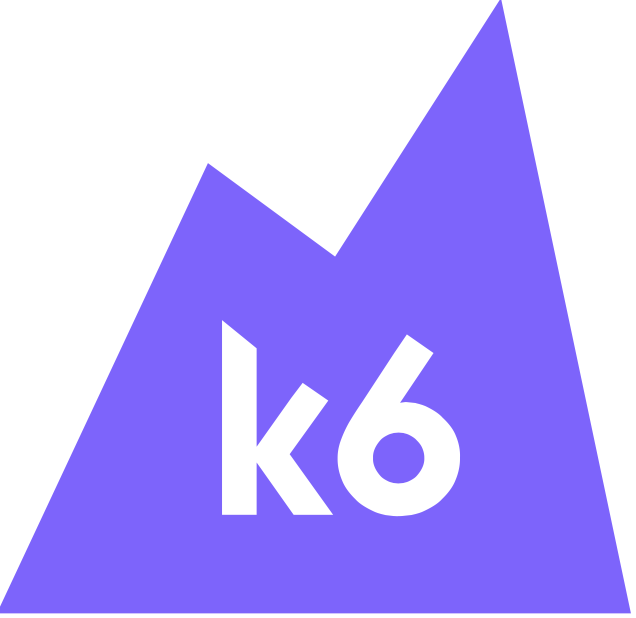

# Project title
Performance test application

## Motivation
Test the application performance

## Features
- N/A

## Run
### k6
**Important** - k6 depends on bank-service and dependencies up and running properly
 ```shell
git clone https://github.com/luizgustavocosta/virtual-threads.git
cd virtual-threads/k6
k6 run --out json=test.json load_test.js
 ```

## Languages and Tools:
<div>
  &nbsp;
  &nbsp;
</div>
</br>

### References
- [K6](https://k6.io/docs/)