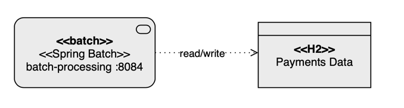

# Project title
Standalone application

## Motivation
Application to run Platform Threads and Virtual Threads

## Features
- N/A

## Run
### Virtual Threads
 ```shell
git clone https://github.com/luizgustavocosta/virtual-threads.git
cd virtual-threads/standalone
mvn compile exec:java -Dexec.mainClass="com.costa.luiz.standalone.VirtualThreads"
 ```

### Platform Threads
 ```shell
mvn compile exec:java -Dexec.mainClass="com.costa.luiz.standalone.PlatformThreads"
 ```

## Languages and Tools:
<div>
  &nbsp;
  &nbsp
</div>
</br>

## Architecture:

### Payment processor


### References
- [YouTube - Spring Batch](https://www.youtube.com/watch?v=vLw39E-pIiA)