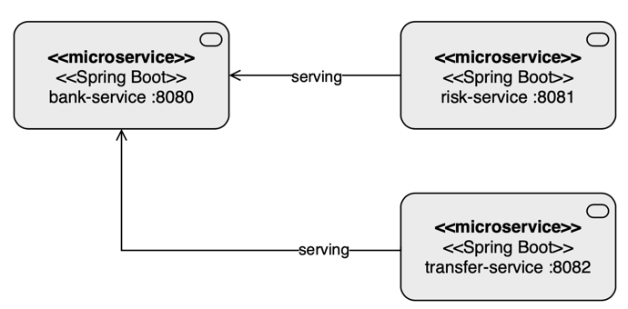

# Project title
Transfer Service

## Motivation
Serve as Transfer API to Money Transfer API

## Features
- Transfer the money

## Run locally
### Docker
````shell
git clone https://github.com/luizgustavocosta/virtual-threads.git
cd virtual-threads/transfer-service
mvn package
docker build -t virtual-threads/transfer-service .
docker run -p 8082:8082 virtual-threads/transfer-service
````
### Command line
```shell
git clone https://github.com/luizgustavocosta/virtual-threads.git
cd virtual-threads/transfer-service
````

#### Option 1

```shell
./mvnw spring-boot:run
```

#### Option 2
```shell
mvn package
java -jar target/transfer-service-0.0.1-SNAPSHOT.jar
 ```

## Languages and Tools:
<div>
  &nbsp;
  &nbsp;
  &nbsp;
  
  &nbsp;
  &nbsp;
  &nbsp;
</div>
</br>

The versions are available [here](../README.md).

## Architecture:

### Money transfer


## API
This API has a POST endpoint that responds after 1 second, in order to simulate a I/O operation

### Examples of usage

#### Transfer
````shell
curl -X 'POST' \
   'http://localhost:8082/v1/transfers/1234-5678/9012-3456/100.01'
````

### References
[Wise - API Transfer](https://docs.wise.com/api-docs/api-reference/transfer)
[Docker](https://spring.io/guides/topicals/spring-boot-docker)